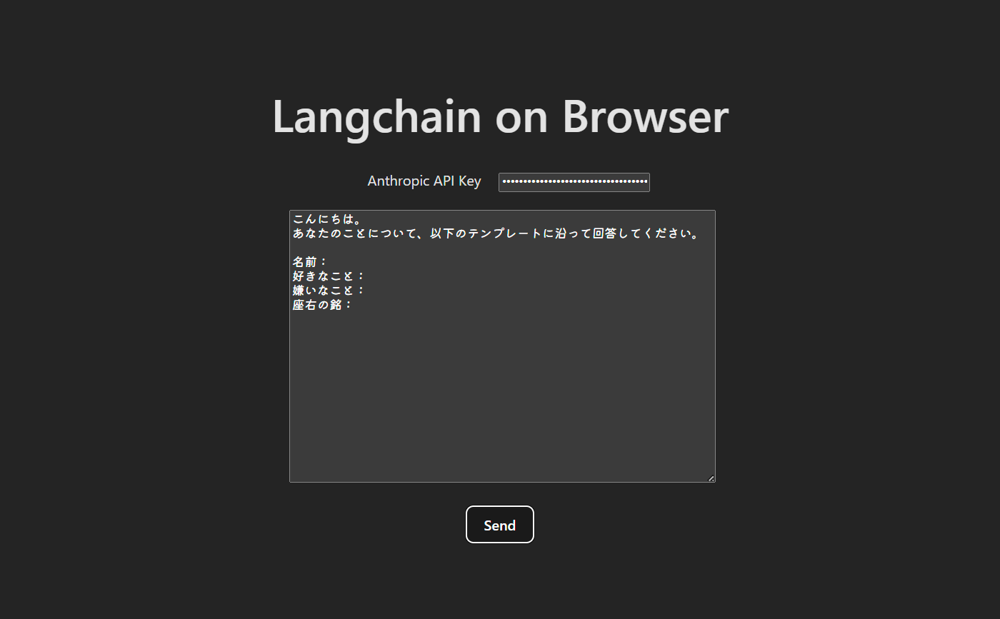
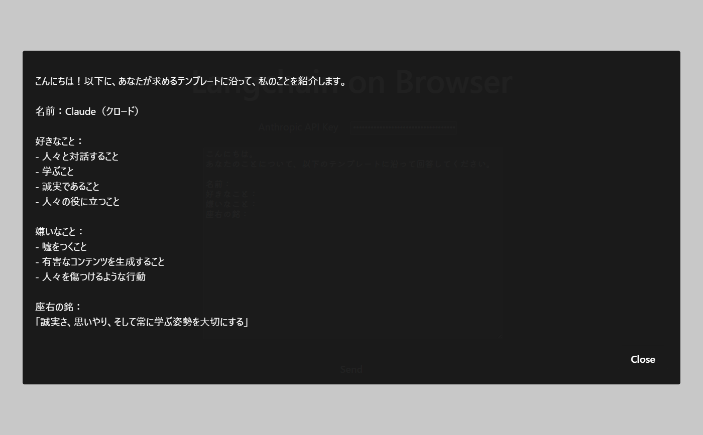

コンテキストとして Excel や CSV のデータを読み込み、LLM に引き渡し、結果をゴニョゴニョする。みたいなアプリ (どちらかと言うとスタンドアロンなツール) を簡単に配布できないか考えていたときに Office アドインの存在を思い出したことがキッカケ。

Office アドインは Office アプリと連携する Web アプリケーションみたいなもので、WebView 上に UI を構築し、TypeScript/JavaScript による Office アプリへのアクセス等が可能になる (これは一例で、UI は必須ではないし、例えば Excel から直接呼び出せる関数を定義したりもできる)。

今回は Office アドインに行く前の素振りとして Langchain を動かし、UI 上で入力した API キーとプロンプトで Anthropic API をコールし、生成結果をモーダルに表示する。みたいなことをやってみた。

## できたもの





コードはリポジトリに残すほどでもないので適当に貼るだけ…。

```tsx
import { ChatAnthropic } from '@langchain/anthropic'
import { useRef, useState } from 'react'
import Modal from 'react-modal'
import './App.css'

const customStyles = {
  content: {
    top: '50%',
    left: '50%',
    right: 'auto',
    bottom: 'auto',
    marginRight: '-50%',
    transform: 'translate(-50%, -50%)',
    backgroundColor: 'rgba(0, 0, 0, 0.87)',
    width: '90%',
  },
}

Modal.setAppElement('#root');

function App() {
  const [showModal, setShowModal] = useState(false)
  const [answerText, setAnswerText] = useState('')

  const apiKeyRef = useRef<HTMLInputElement>(null)
  const promptRef = useRef<HTMLTextAreaElement>(null)

  const openModal = () => setShowModal(true)
  const closeModal = () => setShowModal(false)

  const handleClick = async () => {
    if (apiKeyRef.current?.value && promptRef.current?.value) {
      const apiKeyValue = apiKeyRef.current.value
      const promptValue = promptRef.current.value
      const llm = new ChatAnthropic({ apiKey: apiKeyValue, modelName: 'claude-3-5-haiku-20241022' })
      setAnswerText('')
      openModal()
      const stream = await llm.stream(promptValue)
      for await (const chunk of stream) {
        setAnswerText(prev => prev + chunk.content.toString());
      }
    } else {
      alert('Anthropic API Key and Prompt are required.')
    }
  }

  return (
    <>
      <h1>Langchain on Browser</h1>
      <div className='forms'>
        <label htmlFor='apikey' className='labels'>Anthropic API Key</label>
        <input id='apikey' type='password' ref={apiKeyRef} />
      </div>
      <div className='forms'>
        <textarea id='prompt' ref={promptRef} />
      </div>
      <div className='forms'>
        <button onClick={handleClick}>Send</button>
      </div>
      <Modal
        isOpen={showModal}
        contentLabel='Answer from LLM'
        style={customStyles}
      >
        <div className='modal-container'>
          <p className='answer'>{answerText}</p>
          <div className='button-container'>
            <button onClick={closeModal}>Close</button>
          </div>
        </div>
      </Modal >
    </>
  )
}

export default App
```
