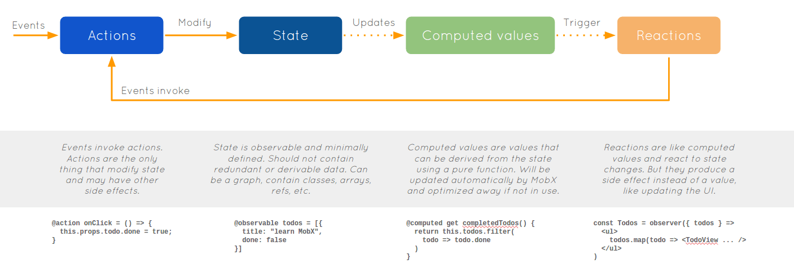

react の状態管理のデファクトとなっている redux ですが、ボイラープレート的な記述が多く、またそれらが複雑に噛み合うことで学習コストが高く感じる部分があります。

* `Action`はタイプとペイロードを持つ単なるオブジェクトである。
* `ActionCreator`は上述の`Action`を返す関数である。
* `Reducer`が上述の`Action`を受けて、新しいステートを返す。

また、非同期ロジックなどの副作用を扱う場合は、ミドルウェアを挟む必要がある。

* [redux-thunk](https://github.com/gaearon/redux-thunk)
* [redux-saga](https://github.com/redux-saga/redux-saga)
* [redux-observable](https://github.com/redux-observable/redux-observable)
* ...

これらを適切に組み合わせることでアプリケーションを構築していくことになりますが、環境構築に時間が掛かり、プロダクトコードを書き始める頃にはすでに疲弊してしまいます。今回は react の状態管理をシンプルに扱うことが可能な mobx に触れてみます。

mobx ?
---

[mobx](https://mobx.js.org/index.html) は、状態遷移を適切に扱うことができるライブラリです。観測可能な値、その値の変更に伴う副作用、アクションをデコレーターを用いて見通しのよいコードを記述することができます。



イベントを伴うアクションを契機にステートを更新する部分こそ Flux パターンと変わりませんが、ステートの更新とそれに伴う副作用をどう実装するかは、mobx では特に規定しません。

* Flux デザインに則ってもよし。
* RxJS でイベント処理してもよし。
* 単純にイベントハンドラで処理してもよし。

ガチガチのボイラープレート的な実装ではなく、ある程度実装者側の裁量で実装パターンを決められるのはいいところですね。

チュートリアル的なアプリを作成する
---

この手のライブラリのチュートリアルと言えばTODOアプリですよね。ということで、例に漏れず mobx を利用して超絶シンプルなTODOアプリを構築してみようと思います。

### 依存モジュール

ところどころのバージョンが古いですが、`package.json`は次のようになっています。

```json
{
  "devDependencies": {
	"babel-core": "^6.9.1",
	"babel-loader": "^7.1.2",
	"babel-plugin-transform-decorators-legacy": "^1.3.4",
	"babel-preset-es2015": "^6.9.0",
	"babel-preset-react": "^6.5.0",
	"babel-preset-stage-1": "^6.5.0",
	"react-hot-loader": "^3.0.0-beta.2",
	"webpack": "^3.5.5",
	"webpack-dev-server": "^2.7.1"
  },
  "dependencies": {
	"mobx": "^3.0.0",
	"mobx-react": "^4.1.0",
	"react": "^15.1.0",
	"react-dom": "^15.1.0"
  }
}
```

### アプリケーションを実装する

#### エントリーポイント

* ./src/index.js

```javascript
import React from 'react'
import ReactDom from 'react-dom'

import App from './App'
import TodoList from './models/TodoList'

// create initialStore
const store = new TodoList()
store.addTodo('Get Cofee')
store.addTodo('Write simpler code')
store.todos[0].finished = true

ReactDom.render(
  <App todoList={store} />,
  document.getElementById('root')
)
```

なんということでしょう。

mobx を使用するための準備はこれだけです。今回は `TodoList` という単一のモデルを用意しアプリケーションルートの `prop` に渡しています。redux のように一枚岩のステートにすることもできますし、コンポーネント単位にステートを作成することも可能です。

しかし一枚岩のステートにしてしまうと、子コンポーネントへは `prop` をチェーンしていく必要があり、親子間が密結合になってしまうので、なるべくコンポーネント単位でステートを作成する実装が適していると感じます。

#### モデル（ステート）

* ./src/models/Todo.js

```javascript
import { observable } from 'mobx'

export default class Todo {
  id = Math.random()
  @observable title = ''
  @observable finished = false

  constructor(title) {
	this.title = title
  }
}
```

見慣れない記述が出てきました。

`@observable` デコレーターは、このモデルのフィールドを観測対象とすることを mobx に伝えます。この observable なフィールドの変更を検知し、mobx は値の再計算、リアクションを発生させます。

* ./src/models/TodoList.js

```javascript
import { observable, computed, action } from 'mobx'
import Todo from './Todo'

export default class TodoList {
  @observable todos = []

  @computed
  get unfinishedTodoCount() {
	return this.todos.filter(todo => !todo.finished).length
  }

  @action.bound
  addTodo(title) {
	this.todos.push(new Todo(title))
  }
}
```

こちらにもデコレーターがあるようです。

`@computed` デコレーターは、対象の関数が参照している observable なフィールドの変更を検知し、関数を実行します。

`@action` デコレーターは、状態を変更させる操作に付与します。このデコレーターは必須ではありません。無くても問題なく動作します。しかしアクションに対してトランザクションが有効になるので、基本的にはデコレーターを付与したほうがよいでしょう。

#### アプリケーション本体

* ./src/App.js

```javascript
import React, { Component } from 'react'
import ReactDom from 'react-dom'
import { observer } from 'mobx-react'

@observer
class App extends Component {
  render() {
	return (
	  <div>
		<div>
		  <ul>
			{this.props.todoList.todos.map(todo => (
			  <TodoView todo={todo} key={todo.id} />
			))}
		  </ul>
		  Tasks left: {this.props.todoList.unfinishedTodoCount}
		</div>
		<br />
		<AddTodo addTodo={this.props.todoList.addTodo} />
	  </div>
	)
  }
}

const TodoView = observer(({ todo }) => (
  <li>
	<input
	  type="checkbox"
	  checked={todo.finished}
	  onClick={() => (todo.finished = !todo.finished)}
	/>
	{todo.title}
  </li>
))

const AddTodo = ({ addTodo }) => {
  let textInput = null
  return (
	<div>
	  <input type="text" ref={ref => (textInput = ref)} />
	  <input
		type="button"
		value="Add Todo"
		onClick={() => addTodo(textInput.value)}
	  />
	</div>
  )
}

export default App
```

`App` クラスに `@observer` デコレーターが追加されていることに注目して下さい。

このデコレーターは mobx と react コンポーネントを繋ぎこむ役割を果たしています。そのおかげで実装者が意識すること無く、ステートの更新に応じたコンポーネントの再レンダリングを行うことができます。

まとめ
---

今回は、react アプリケーションの状態管理を助けてくれる mobx をご紹介しました。

個人的には redux よりは取っ掛かり易いかなという印象でしたが、あくまでサンプルコードベースなので、大規模なプロジェクトになってくると実装の制約が厳しい redux の方が適しているのかもしれません。 このへんはおいおいもう少し触ってみることにします。

それでは。
