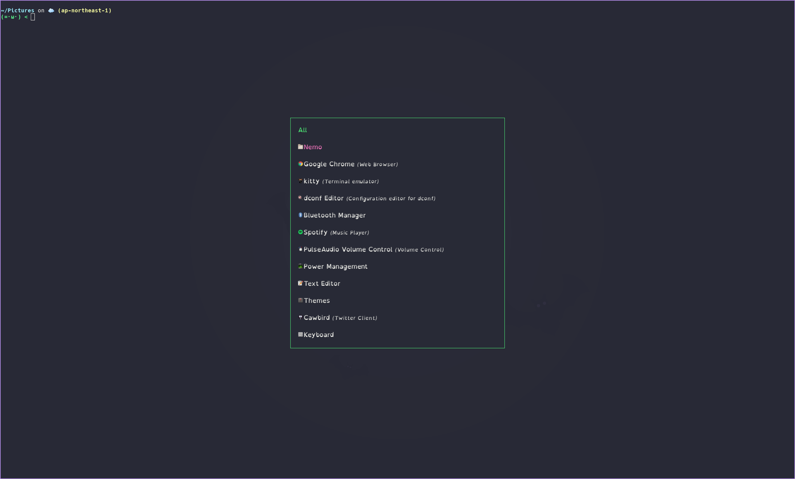

基本的には [dotfiles](https://github.com/syuni/dotfiles) を見れば雰囲気は掴めそうではあるが (README 更新してない感が満載)。

xorg じゃないので、動かないものもあったが、基本的にここに書いているものは動いている (xwayland によるものかもしれないが)。

あれこれ~~パクり~~参考にさせてもらいつつ、好きなテーマ ([Dracula](https://draculatheme.com/contribute)) のカラーパレットでまとめている。

フォント
--
* Hack Nerd Font (terminal)
* RobotoMono (waybar)
* Noto CJK (browser)
* dyslexic (rofi)

dyslexic は失読症向けのフォントらしいが、パッと見よさげだったので rofi のフォントに使っている。

入力関係
--
* ibus
* ibus-skk

ブラウザ
--
* Google Chrome

ステータスバー
--
* [Waybar](https://github.com/Alexays/Waybar)

ランチャー
--
* [rofi](https://github.com/davatorium/rofi)

なんだかよろしく動いてるっぽい。

通知
--
* [mako](https://github.com/emersion/mako)

ターミナル
--
* [tilix](https://gnunn1.github.io/tilix-web/)

ファイラ
--
* [ranger](https://github.com/ranger/ranger)

ただ、イメージバックエンドの `ueberzug` が X11 のものなので、サムネイルできてない。
