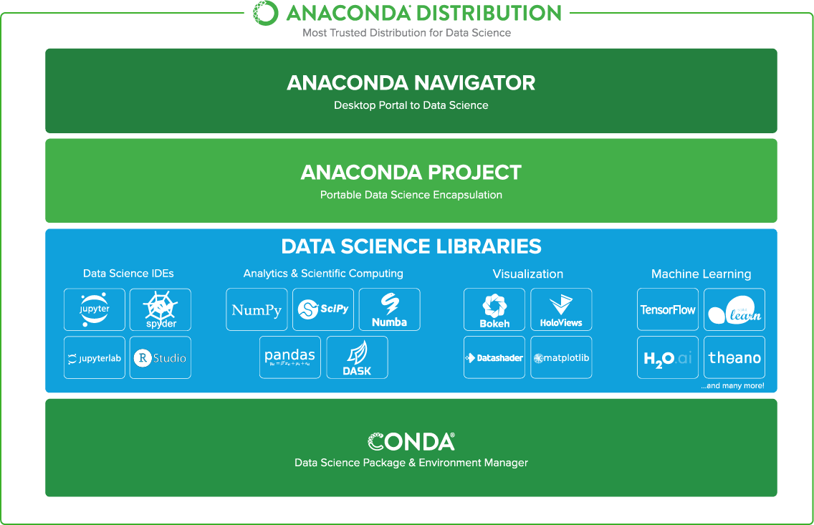
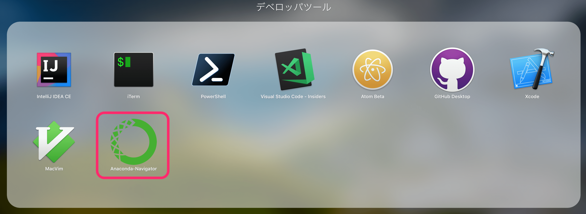
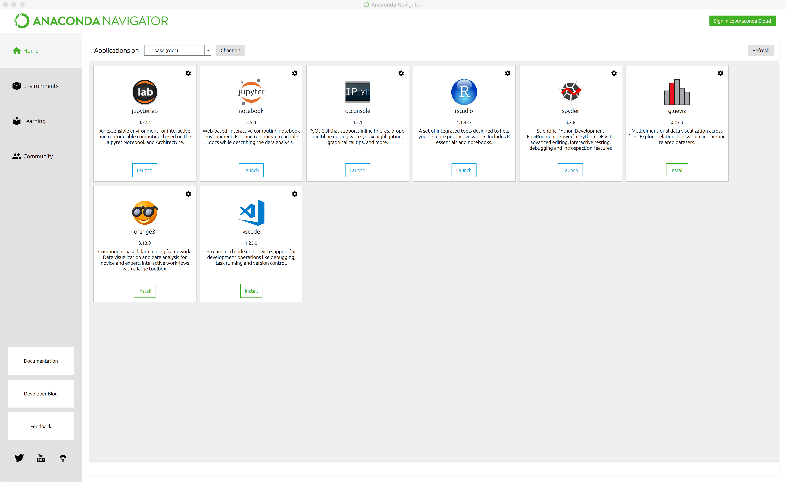
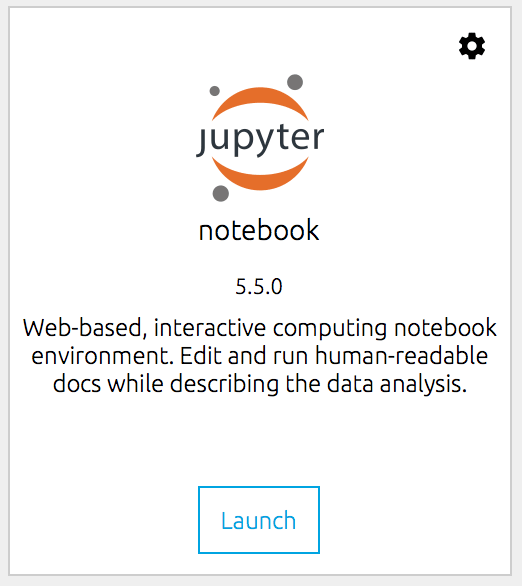
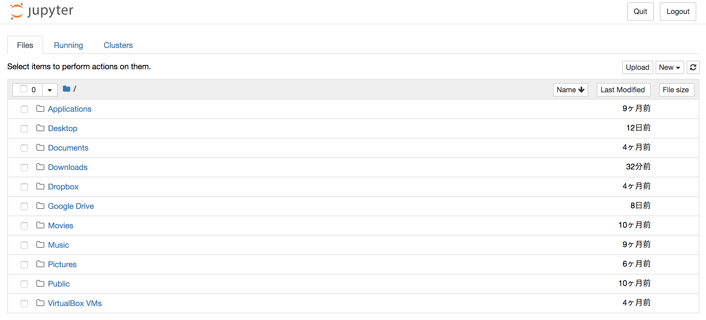

最近、仕事でも Python を扱うことが多くなってきました。Python といえば、やはり機械学習が有名ですよね。自分のPCでも Python を触ってみるべく、ディストリビューションの一つである `Anaconda` をインストールし、データサイエンティスト・機械学習エンジニア気分に浸ってみましょう。

Anaconda
---

> [Anaconda](https://www.continuum.io/) はデータサイエンス向けに作成された Pythonパッケージで、科学技術計算などを中心とした数多くのモジュールやツールが独自の形式で同梱されています。 macOSやUnix環境では、ほとんどのモジュールがコンパイル済みパッケージを提供しているため、Anaconda を使わなくとも、通常の [pip](https://www.python.jp/install/windows/pip.html) コマンドでも簡単に環境を構築できます。 しかし、Windows環境のように、簡単にインストール可能なモジュールが提供されていない環境で、機械学習などのためにPython を使用するなら、多くのモジュールがデフォルトでインストールされる Anaconda はとても便利です。

ほうほう、どうやら Python だけでなく、分析や機械学習向けのライブラリが標準でインストールされているようです。pip で自身で同様の環境を作ることは可能ですが、Anaconda 一つインストールするだけでそれらの恩恵を享受することができるのはうれしいですね。



Anaconda をインストールしてみる
---

公式サイトからダウンロードすることもできますが、今回は Python の環境分離ツールである pyenv を使用してインストールしてみることにしましょう。

まずはインストール可能な Anaconda ディストリビューションを検索します。

```bash
$ pyenv install -l | grep anaconda3
```

続いて、上記の結果から任意のバージョンをインストールします。

```bash
$ pyenv install anaconda3-x.x.x
```

インストールが終わったら、Anaconda が有効になるようにグローバルに設定します。

```bash
$ pyenv global anaconda3-x.x.x

# バージョンを確認し、`:: Anaconda, Inc.`が出力されていればOK
$ python --version
Python x.x.x :: Anaconda, Inc.
```

Anaconda-Navigator を起動してみる
---

Anaconda-Navigator からは、各種パッケージの管理や、アプリのランチャー、環境変数の管理などをグラフィカルUIを用いて行うことができます。





RStudio や VSCode もここから起動できて超絶便利。

Jupyter Notebook を起動してみる
---

Jupyter-Notebook では、ブラウザを利用してアプリケーションの管理やコードの管理・実行、ドキュメントの執筆などを行うことができます。本来であればコードを書いて→保存して→実行して→コードを書いて→実行して→…と手間が掛かっていた部分をブラウザ上で直接コードを書いてインタラクティブに実行することができるようになります。

Anaconda-Navigator から Jupyter-Notebook を起動できます。

次のイメージのようなタイルの `Launch` アイコンをクリックします。



ブラウザが起動し、次のような画面が表示されれば成功です。



ここからプロジェクトの管理や、新規ドキュメントの作成が行えます。

Anaconda を使用することで余計な作業なくすぐに Python・R を用いた分析・機械学習を始めることができます。機械学習に興味があるけど、環境作るの面倒くさい、難しそう。と思っている方は、 Anaconda を使って初めてみては如何でしょうか。

では、今回はここまで。
